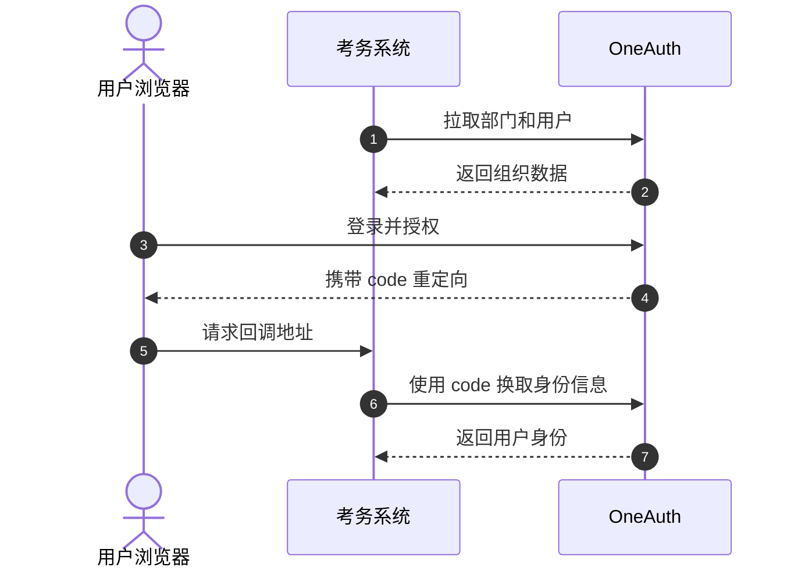

# Enterprise Exam

面向企业内部培训与考核的在线考务平台，基于 **FastAPI + Vue 3** 构建，支持题库、试卷、考试发布、在线答题、自动/人工阅卷、成绩分析和 OneAuth 统一身份认证。

生产环境可通过 Docker 以单端口运行完整系统；本地开发默认使用 SQLite，无需额外准备数据库。

## 功能概览

- **身份与组织**：OneAuth OAuth2 登录、部门与员工同步、角色权限控制
- **题库与试卷**：单选、多选、判断、填空、简答题，可视化组卷与分值校验
- **考试管理**：考试时间、参与范围、公开/保密查卷策略与防切屏设置
- **答题与阅卷**：自动判分、Markdown 简答、图片附件、人工阅卷工作台
- **数据分析**：部门成绩、通过率、分数分布、知识盲区及明细导出
- **一体化部署**：Vue 静态资源由 FastAPI 托管，生产环境只需暴露一个端口

## 技术栈

| 层级 | 技术 |
| --- | --- |
| 前端 | Vue 3、Vite、Element Plus、Pinia、ECharts |
| 后端 | FastAPI、SQLAlchemy、Pydantic、JWT |
| 数据库 | SQLite（本地开发）/ MySQL 8.0（生产部署） |
| 部署 | Docker Compose、Uvicorn |

## 快速开始

### 方式一：本地开发

环境要求：

- Python 3.10+
- Node.js 20.19+ 或 22.12+
- npm

Windows：

```powershell
git clone <仓库地址>
cd exam
.\start.cmd
```

macOS / Linux：

```bash
git clone <仓库地址>
cd exam
chmod +x start.sh
./start.sh
```

脚本会自动创建 Python 虚拟环境、安装缺失依赖并启动前后端：

| 服务 | 默认地址 |
| --- | --- |
| 前端 | http://127.0.0.1:5173 |
| 后端 | http://127.0.0.1:8000 |
| Swagger API 文档 | http://127.0.0.1:8000/docs |

Windows 端口被占用时，可直接指定备用端口：

```powershell
.\start.cmd -BackendPort 8010 -FrontendPort 5174
```

停止脚本启动的服务：

```powershell
.\start.cmd -Action stop
```

```bash
./start.sh stop
```

也可以分别启动服务：

```bash
# 终端 1：后端
cd backend
python -m venv .venv

# Windows
.venv\Scripts\python -m pip install -r requirements.txt
.venv\Scripts\python -m uvicorn app.main:app --host 0.0.0.0 --port 8000 --reload

# macOS / Linux
.venv/bin/python -m pip install -r requirements.txt
.venv/bin/python -m uvicorn app.main:app --host 0.0.0.0 --port 8000 --reload
```

```bash
# 终端 2：前端
cd frontend
npm install
npm run dev -- --host 0.0.0.0 --port 5173
```

### 方式二：Docker 生产部署

环境要求：Docker 20.10+、Docker Compose 2.0+。

```bash
git clone <仓库地址>
cd exam
cp .env.example .env
```

上线前至少修改 `.env` 中的数据库密码、`SECRET_KEY`、OneAuth 凭据和回调地址，然后执行：

```bash
chmod +x deploy.sh
./deploy.sh start
```

默认访问地址：

- 系统入口：`http://<服务器地址>:8000`
- API 文档：`http://<服务器地址>:8000/docs`

常用运维命令：

| 操作 | 命令 |
| --- | --- |
| 启动或重新构建 | `./deploy.sh start` |
| 停止服务 | `./deploy.sh stop` |
| 重启服务 | `./deploy.sh restart` |
| 查看应用日志 | `./deploy.sh logs` |
| 查看全部日志 | `./deploy.sh logs-all` |
| 备份数据库 | `./deploy.sh backup` |

MySQL 数据和上传附件分别保存在 Docker 卷 `exam_mysql_data` 与 `exam_uploads_data` 中，重新构建应用容器不会清空业务数据。

## 初始账号

首次启动会自动初始化演示数据：

| 项目 | 默认值 |
| --- | --- |
| 用户名 | `admin` |
| 密码 | `admin123` |
| 角色 | 超级管理员 |

> 生产环境登录后请立即修改默认密码。

## 环境变量

Docker 部署从项目根目录的 `.env` 读取配置。

| 变量 | 默认值 | 说明 |
| --- | --- | --- |
| `PORT` | `8000` | 系统对外端口 |
| `MYSQL_PORT` | `3306` | MySQL 宿主机端口 |
| `MYSQL_DATABASE` | `exam_db` | 数据库名称 |
| `MYSQL_USER` | `exam_user` | 业务数据库用户 |
| `MYSQL_PASSWORD` | — | 业务数据库密码 |
| `MYSQL_ROOT_PASSWORD` | — | MySQL root 密码 |
| `SECRET_KEY` | — | JWT 签名密钥，生产环境必须使用随机强密钥 |
| `ONEAUTH_SERVER_URL` | — | OneAuth 服务地址 |
| `ONEAUTH_CLIENT_ID` | — | OAuth2 Client ID |
| `ONEAUTH_CLIENT_SECRET` | — | OAuth2 Client Secret |
| `ONEAUTH_REDIRECT_URI` | — | 登录回调地址，例如 `https://exam.example.com/auth/callback` |

生成随机 `SECRET_KEY` 的示例：

```bash
python -c "import secrets; print(secrets.token_urlsafe(48))"
```

## OneAuth 通信方式

考务系统与 OneAuth 的服务端通信均由考务系统主动发起；登录完成后，OneAuth 通过用户浏览器重定向回考务系统。因此 OneAuth 不需要主动访问考务系统的内网地址，但以下链路必须可达：

1. 考务系统服务器能够访问 `ONEAUTH_SERVER_URL`。
2. 用户浏览器能够访问 OneAuth 登录页。
3. 用户浏览器能够访问 `ONEAUTH_REDIRECT_URI`。



## 项目结构

```text
exam/
├── backend/
│   ├── app/
│   │   ├── api/v1/       # API 路由
│   │   ├── core/         # 配置、数据库与安全逻辑
│   │   ├── models/       # SQLAlchemy 模型
│   │   └── services/     # 业务服务
│   ├── tests/
│   └── requirements.txt
├── frontend/
│   ├── public/
│   ├── src/
│   │   ├── api/
│   │   ├── router/
│   │   ├── stores/
│   │   └── views/
│   └── package.json
├── docker-compose.yml
├── Dockerfile
├── deploy.sh
├── start.cmd
├── start.ps1
└── start.sh
```

## 常见问题

### 端口已被占用

本地开发可指定其他端口：

```powershell
.\start.cmd -BackendPort 18080 -FrontendPort 15173
```

Docker 部署可修改 `.env` 中的 `PORT` 和 `MYSQL_PORT`。

### 前端能打开，但接口请求失败

确认后端已启动，并检查 `frontend/vite.config.js` 的代理目标。本地一键脚本会自动把前端代理指向本次使用的后端端口。

### Docker 构建拉取镜像超时

先确认服务器能够访问 Docker Hub：

```bash
curl -I --connect-timeout 15 https://registry-1.docker.io/v2/
```

若连接超时，请配置可用的镜像加速器或网络代理后重新执行 `./deploy.sh start`。

### 查看启动日志

本地脚本的日志位于项目根目录 `.run/`：

```text
.run/backend.out.log
.run/backend.err.log
.run/frontend.out.log
.run/frontend.err.log
```

Docker 环境使用：

```bash
./deploy.sh logs-all
```

## 开发检查

提交前建议至少执行：

```bash
cd frontend
npm run build
```

```bash
cd backend
python -m pytest
```

## License

如需对外发布或商业分发，请先在仓库中补充适用的许可证文件。
